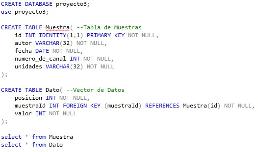
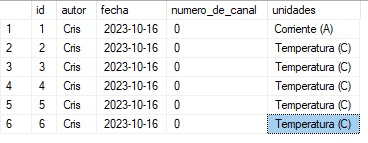

# Laboratorio III: Diseño de un sistema de adquisición de datos. Parte II

# *Resultados del Lab3*

## Diseño de GUI

Se muestran el diagrama de bloques generado para la lógica de los controles seleccionados dentro del GUI de LabView, donde es posible apreciar en cierto grado cada una se las secciones; lógica de seleccción de botones, recepción y envió de datos mediante *VISA* y el llamado realizado a la base de datos nombrada "proyecto3".

Este diagrama se basa en el siguiente diseño de ventana.

### Base de Datos

Para la base de datos se utilizó el software *SQL Server* para codificar el funcionamiento. Este fue guardado con el nombre "proyecto3", de manera que mediante este titulo se le implementó en el GUI de LabView.

Para ejemplificar el funcionamiento de la base de datos se muestran ciertos valores agregados mediante LabView.

## Circuito armado en placa perforada

En la siguiente imagen se muestra el resultado del montaje en de uno de los canales en la placa perforada, de manera que su uso continuo sea más accesible.

La idea fue implementar optoacopadores como "switches" que permitieran realizar los cambios entre cada una de las escalas de medición que se solicitaban.

Mediante el GUI de LabView se selecciona la escala a observar y se envía mediante *Serial.Write()* al Arduino UNO que lo acciona como un pin digital en alto para el pin seleccionado para cada escala. De manera que la señal en alto de $5 V$ permitiera accionar el optoacoplador y este cerrara el circuito con el amplificador operacional que aplica las ganancias.

Se muestra el circuito básico de funcionamiento como switch para el opotoacoplador.

Ahora se adicionando el amplificador operacional se vería de la siguiente forma.

## Mediciones

## Demostración del funcionamiento

[Video Demostrativo 1](URL)

