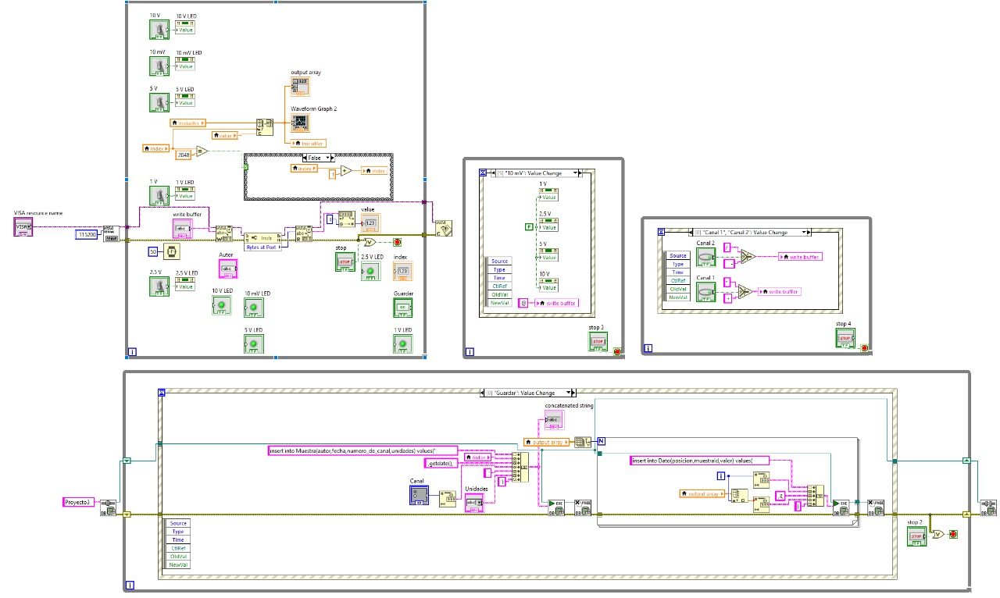
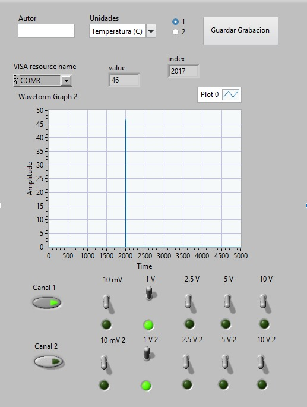
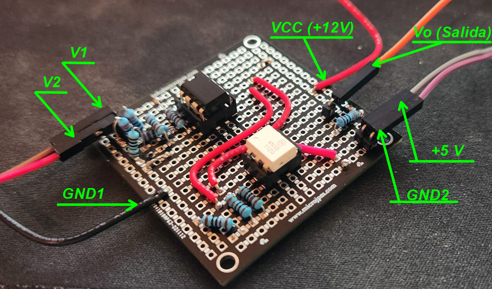
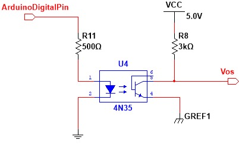
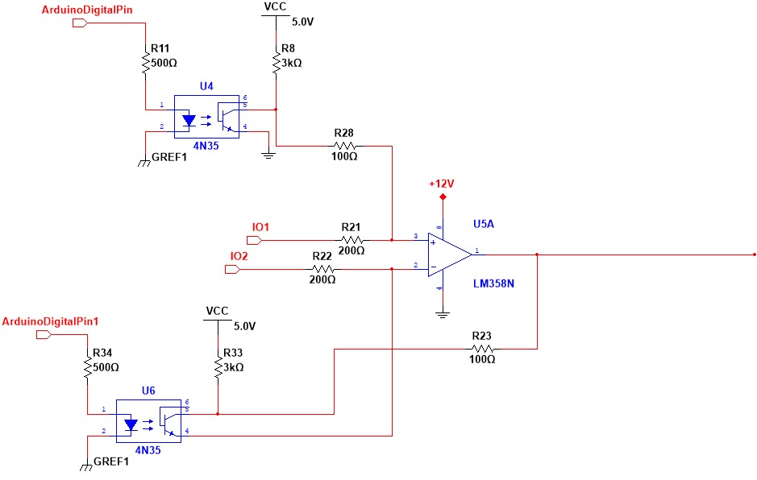

# Laboratorio III: Diseño de un sistema de adquisición de datos. Parte II

# *Resultados del Lab3*

## Diseño de GUI

### Base de Datos

## Mediciones

## Circuito armado en placa perforada

## Demostración del funcionamiento

[Video Demostrativo 1](URL)

